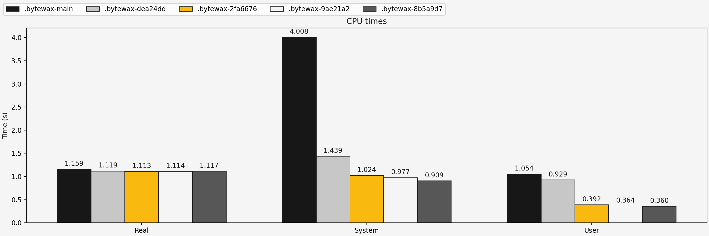
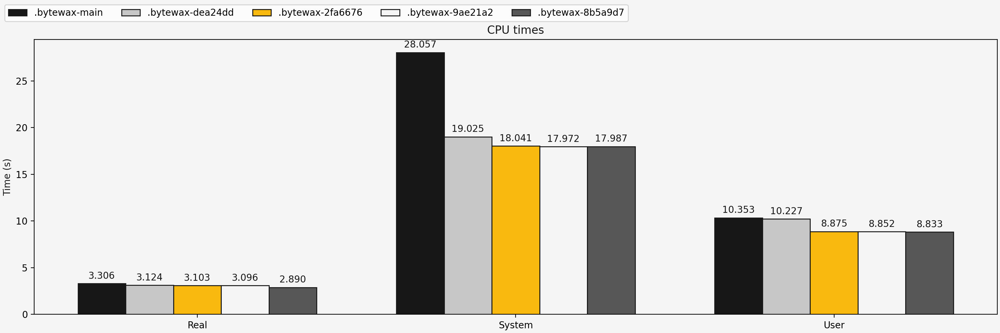
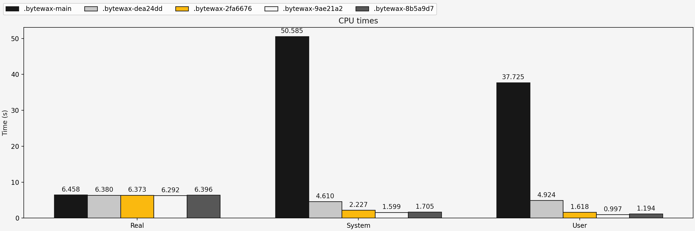
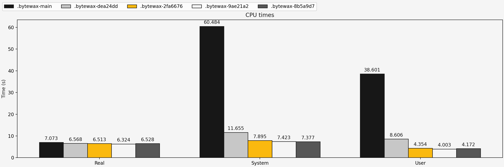
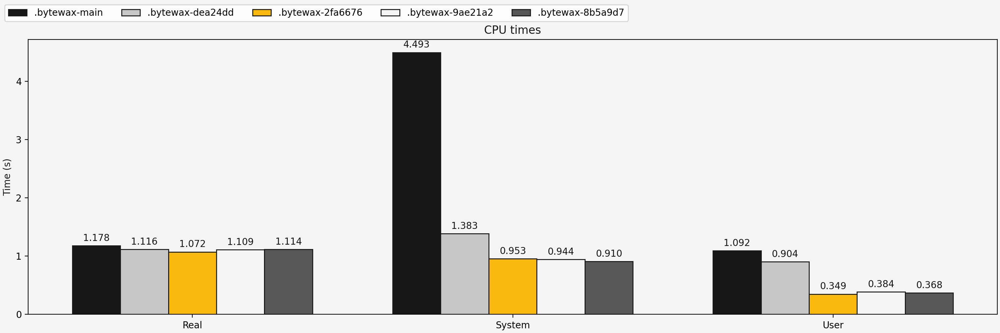
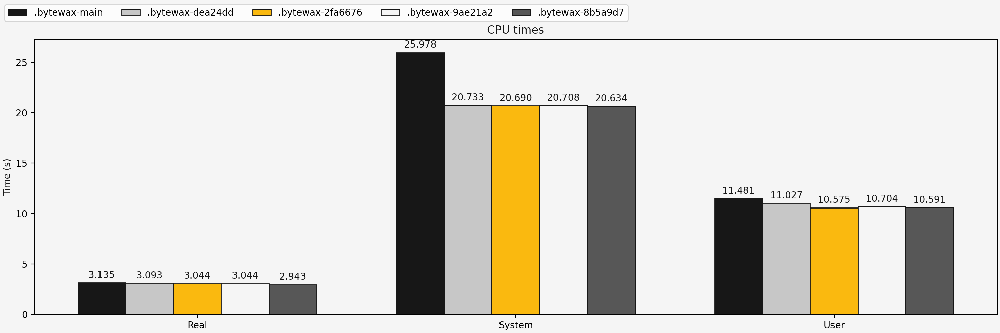
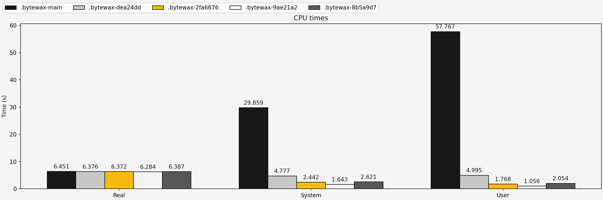
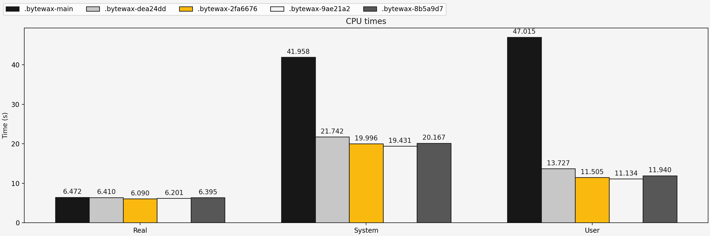

# Bytewax benchmarks

This repository holds some code for a specific benchmark for bytewax.  
We have an issue where our workers spin polling for input, that causes each process to eat as much cpu as possible, busy waiting.  

A solution should be able to run a dataflow in more or less the same amount of total time, using much less cpu overall.
This repository has a runner script and some parametric dataflows (bytewax>=0.16) to compare different possible solutions.
The dataflows have 2 parameters: heavy_map and long_input.

`heavy_map` adds a `map` operation that does CPU (and memory) heavy work, and this is the case where we do want all the available cpu time to be used.  

`long_input` uses an input source that emits a new item every ~0.25 seconds, returning None while the item is not ready.
In this case bytewax==0.16.0 spins, and uses all the available cpu.  

The fix should show that a dataflow with `heavy_map` still utilizes all the available cpu (and thus finishes the operation in the same amount of time),
but dataflows with `long_input` should use much less overall cpu compared to the non fixed version.

Here we use hyperfine to compare old and fixed versions on the different dataflows.
The metric we are trying to improve is the total "system time" used by all the processes in a dataflow run, without making "real" time worse.

The `compare.sh` script accepts a list of commit hashs, or tags, or revisions.
It will create a virtualenv for each of those, and run the dataflows with all the versions specified:

```sh
./compare.sh v0.16.0 7b8caa3
```

By asking the workers to be parked for as little as 1ms before reactivating again, the overall cpu usage drops dramatically.
In a run with 16 processes (same number as threads on my laptop), with an input that waits before outputting items, without heavy computations, system time goes from ~48s down to ~4s.
This is due to the fact that we are not polling the input as fast as possible anymore.
Surprisingly, the overall time of execution is slightly better too. Not significantly better, but constantly so.  

## Results

You can plot the results by running:
```sh
./plot.sh
```

### Partitioned input
#### Fast input, fast operations

#### Fast input, cpu heavy operations

#### Long input, fast operations

#### Long input, cpu heavy operations


### Dynamic input
#### Fast input, fast operations

#### Fast input, cpu heavy operations

#### Long input, fast operations

#### Long input, cpu heavy operations

